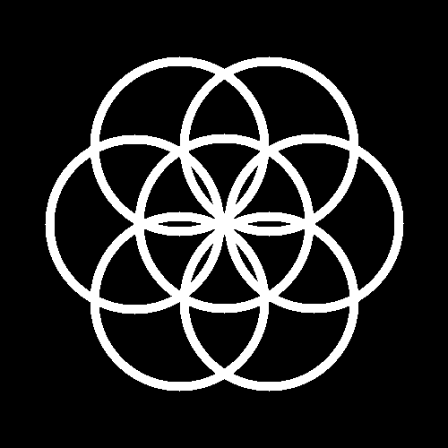

# 🐣 S1 | Prog: Workshop

----

# 💨 Rapport de la semaine - Workshop de programmation et algorithmie 💨
Du 20 au 24 novembre 2023
**Par Muracciole Lisa et Ruiz Fanny**

----

## ⭐ onlyGreen
 

## ⭐ changeRedBlue
 

## ⭐ blackAndWhite
 
**Explication**
Pour ce programme, le principe était de faire la moyenne des trois couleurs de chaque pixel et de réappliquer cette moyenne à chacune des trois couleurs : elles s'équilibrent et donnent du gris.

## ⭐negative
 
**Explication**
Nous avons pris le complément à 1 des trois couleurs de chaque pixel.

## ⭐ gradient
 
**Explication**
Le principe est de parcourir l'image sur les lignes et colonnes et "d'éclaircir" chaque pixel au fur et à mesure que x augmente.

**NB :** Une autre façon de faire : utiliser la valeur précédente en incrémentant (en faisant attention à faire démarrer x à 1).

```cpp
image.pixel(x, y).r += image.pixel(x-1, 0).r + 1.f/(image.width() -1);
```

## ⭐⭐ mirror
 

### *mirror1*
**Explication**
Pour ce programme, il s'agit d'utiliser la fonction *reverse* (de la librairie *algorithm*), qui permet d'inverser les tableaux (le premier élément devient le dernier, et ainsi de suite).

Nous en avions entendu parler en TD et nous nous sommes dit que cela pouvait s'avérer utile, du fait qu'une image est considérée comme un tableau. C'était également une bonne occasion de se familiariser avec.

Nous n'avons pas sû comment s'en servir directement car nous ne comprenions pas ce que signifiait myvector.begin() dans la documentation (on pensait que c'était spécifique à l'exemple). Puis, on a cru que simplement utiliser reverse sur toute l'image pouvait fonctionner. Or, il fallait le faire ligne par ligne pour avoir un résultat en miroir horizontal, d'où l'ajout d'un *for* qui s'incrémente d'une longueur de ligne. 

### *mirror2*
**Explication**
On parcourt seulement la partie gauche de l'image qu'on a divisé à la moitié de la longueur de l'image. Puis, on inverse la couleur deux à deux des pixels qui sont symétriques par rapport à l'axe du milieu.

## ⭐⭐ noise
 
**Explication**
Pour ce programme, il fallait d'abord scruter l'indice : *"Remplacez quelques pixels au hasard par une couleur aléatoire"*.

Il fallait donc :
- Indiquer à la machine des coordonnées aléatoires pour un pixel, c'est-à-dire x et y aléatoires;
- Modifier sa couleur de façon aléatoire, c'est-à-dire remplacer les valeurs color.r, color.v et color.b par des valeurs aléatoires.

Ainsi, 
`int x = random_int(0, image.width())` et  `int y = random_int(0, image.height())` permettent de prendre une valeur aléatoire de x et y sans dépasser de l'image (x pas plus grand qu'une ligne, y pas plus grand qu'une colonne);

`image.pixel(x, y).r = random_float(0, 1);)` applique une valeur aléatoire au niveau de rouge (on fait de même pour le niveau de vert et de bleu).

Pour répéter cette opération un grand nombre de fois, on inclus ce bout de code dans un *for*. 

A la v1, le programme demandait le niveau de bruit (`noiseLvl`) à l'utilisateur, à l'aide d'un `std::cin`. 
Puis, pour que les tests successifs soient plus rapides, on initialise la valeur de `noiseLvl` de façon aléatoire.

## ⭐⭐ rotation90
 
**Explication**
On créé une image ayant pour format la longueur du logo en hauteur et inversement. Pour chaque pixel du logo, on le place sur le canvas par des calculs génériques.

**❗Problèmes❗**
Au début, le logo tournait de 90 degré dans l'autre sens, ce qui signifie que l'écriture IMAC se retrouvait à gauche de l'image et non à droit comme nous le voulions. Ceci s'explique par le fait que nous ne savions pas que l'origine du repère (0,0) est placé non pas en haut à gauche de l'image mais bien en bas à gauche de l'image, tel un repère orthonormé en maths.


## ⭐⭐ RBGSplit
 

## ⭐⭐ brightness
 
 
**Explication**
Pour ce programme, il fallait :

- Mettre au carré les valeurs du vert, rouge et bleu s'il on voulait assombrir l'image;
- Prendre la fonction symétrique a x² par rapport à f(x) = x, soit racine carrée, et l'appliquer à chaque pixel de l'image s'il on voulait l'éclaircir.

C'est pourquoi un *for* pour changer les trois composantes de chaque pixel et un *switch* qui demande à l'utilisateur une valeur selon son choix (assombrir / éclaircir) sont utilisés.

## ⭐⭐ disk
 

## ⭐ circle
 

## ⭐⭐⭐ rosace
 

## ⭐⭐ mosaic
 
**Explication**
Pour ce programme, on commence par créer un canvas de 5 fois la hauteur et 5 fois la largeur (car on veut répliquer 5*5 fois l'image, cependant on pourrait aussi mettre n'importe quel entier).

Puis, on parcourt l'image d'entrée sur les x et y avec deux *for*. Ces deux for sont implémentés dans deux autres *for* qui vont eux parcourir les colonnes et lignes de la mosaïque (une colonne = une hauteur d'image et une ligne = une longueur d'image, il y en a donc 5 de chaque). 

Avec ces quatres *for* imbriqués, on assigne la valeur d'un pixel de l'image d'entrée à la position x et y à un pixel du canvas d'une une ligne et une colonne donnée, à la position x et y. 
L'image se réplique alors à l'identique sur chaque ligne et chaque colonne.

**NB :** au départ, mosaicCanvasRow se nommait mosaicCanvasX, le *for* était écrit ainsi

```cpp
for (int mosaicCanvasX{0}; mosaicCanvasX < 5*image.width(); mosaicCanvasX+=image.width())
```

(et idem pour les colonnes).

Or, pour le programme *mirrorMosaic*, cela a fortement mis des bâton dans les roues car à chaque tour, la valeur mosaicCanvasX tombait sur une valeur paire, ce qui empêchait l'impression des miroirs horizontaux. On a donc utilisé le code qu'il y a actuellement pour *mirrorMosaic*, et plus tard ré-implémenté dans *mosaic* histoire d'harmoniser le tout, optimiser le programme et montrer les ressemblances entre les deux.

## ⭐⭐⭐ mirrorMosaic
 
**Explication**
Pour ce programme, on réutilise le même principe que *mosaic*. 
La différence réside dans un "aiguillage" qui va indiquer au programme où placer son curseur de départ avant de lire et recopier l'image d'entrée. Cela influe sur le sens de l'image recopiée dans la case du canvas.

**NB :** Au début, on a essayé d'utiliser à nouveau *reverse*, pour inverser chaque ligne paire puis chaque colonne paire, sans succès. Cependant, on a su plus tard que l'on pouvait définir un miroir horizontal, vertical et double (en appliquant plusieurs fois *reverse* ou en modifiant *mirror1*), puis l'appeler en fonction du numéro de colonne et de ligne.

## ⭐⭐⭐ glitch
 
**Explication**
Ce programme reprend le principe de la fonction swap pour échanger un rectangle d’une longueur et hauteur aléatoire avec un autre rectangle de même dimensions pris aléatoirement dans l’image. 
On définit donc un point de départ du rectangle en x et en y, un point de départ de l'autre rectangle, puis on échange chaque pixel en parcourant les x et y avec un *for*. 

Pour que tout ce code se répète plusieurs fois, on l'inclut dans un *for* dont le compteur *repetition* s'arrête à un nombre aléatoire *glitchLvl*, de la même manière que pour *noise*.

## ⭐⭐⭐ fractal
 

## ⭐⭐⭐(⭐) vortex
 

## ⭐⭐⭐(⭐) tramage
 
**Explication**
Pour ce programme, j'ai d'abord récupéré les données de la matrice de Bayer et le `const int bayer_n = 4` selon le deuxième lien fourni. 
Ensuite, selon le tutoriel, j'utilise des if et else pour assigner 0 ou 1 à la valeur d'un pixel, selon sa luminosité + une valeur contenue dans la matrice de bayer. Les % sont utilisés pour ne pas sortir de la matrice, cela sert à avoir un peu d'aléatoire au niveau du rendu. 
Pour parcourir toute l'image, comme pour beaucoup de fonctions, j'inclus le if / else dans deux *for* qui incrémentent x et y jusqu'à la longueur (resp. hauteur) de l'image. 

## ⭐⭐⭐(⭐) normalisation
 
**Explication**
Pour normalisation, j'ai tout d'abord initialisé mon pixel le plus sombre à 1 et le plus foncé à 0. Ensuite, je parcours l'image pour trouver le pixel le plus foncé de l'image et le plus clair de l'image ( *for* de *for* en x et y, jusque là rien de nouveau).  J'initialise ma valeur *deltaValue*, puis, parcours à nouveau l'image pour appliquer une formule à chaque pixel afin de recalibrer chacune des composantes.

## ⭐⭐⭐⭐ convolutions
 

### ⭐⭐⭐⭐ algoGeneriqueDeConvolutions

## ⭐⭐ filtresSeparables
 

## ⭐⭐ differenceDeGaussienne
 

## ⭐⭐⭐⭐ pixelSorting
 
**Explication**
Pour ce tri de pixels, j'ai tout d'abord initialisé une longueur de ligne de pixels que je voulais trier, puis l'écart entre ces lignes, aléatoirement. Puis, je parcourt toute mon image en me décalant à chaque fois d'une longueur de ligne + l'écart. Si je ne risque pas de sortir de l'image, le programme trie la rangée, puis assigne une nouvelle valeur aléatoire à l'écart et la longueur de ligne, pour rendre le résultat encore plus aléatoire !